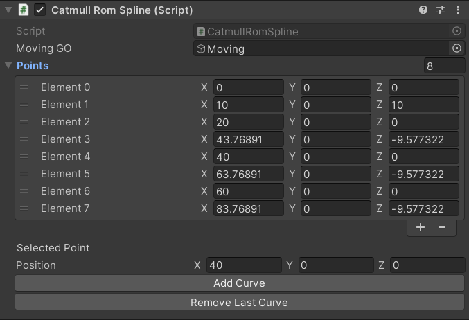
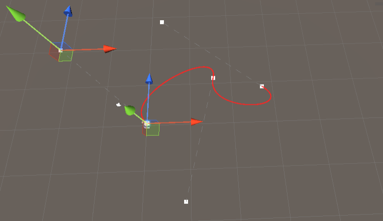
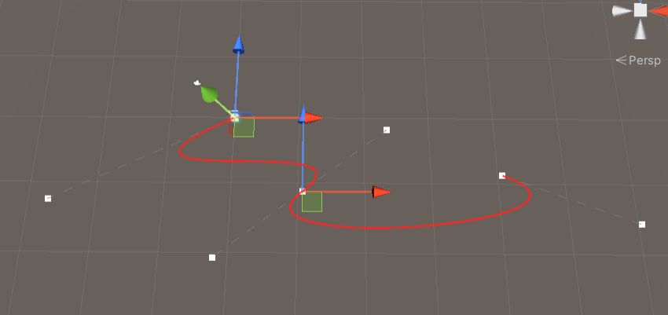
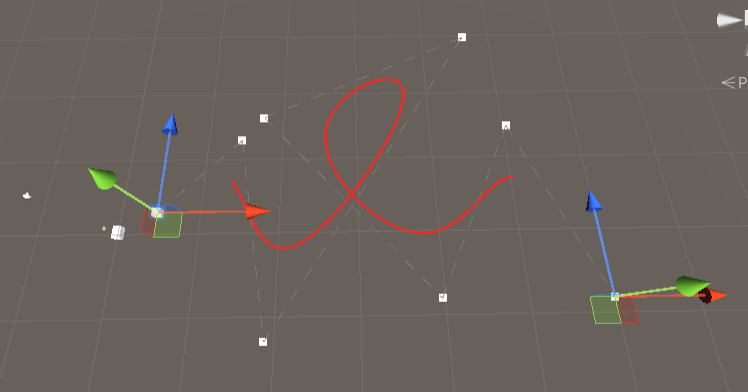
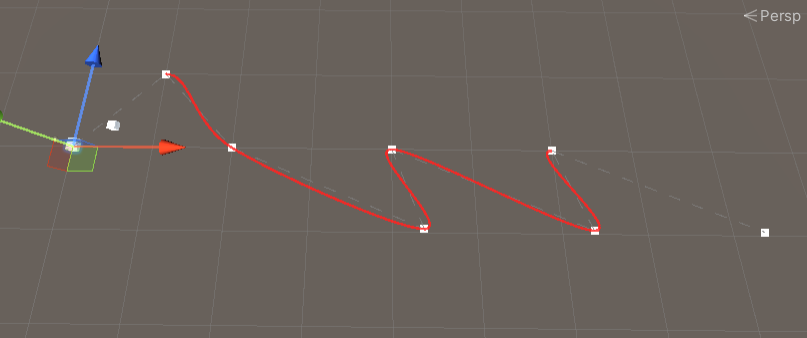

# Splines
Unity project to learn how to implement splines, using matrices, and getting familiar with Unity Editor scripting.  
This project was realized at Isart digital in January 2024, 2 weeks was given to make it.

Editor Scripting sources:
> https://catlikecoding.com/unity/tutorials/curves-and-splines/

Spline computation and junction sources:
> Isart Digital's lessons

### Parameter:
Since Hermitian and Bézier splines use tangent, when moving a control point, it's tangents follow.  
Bézier spline: a points tangents are mirrored, in position and distance.

As parameters, each Spline had:
> A button to add a curve/segment  
> A button to remove the last segment/curve  
> A list to edit spline points  
> A vector to edit a selected point  

## Splines inplemented :
### Hermitian Spline

### Bézier Spline

### B-Spline Spline

### Catmull Rom Spline

